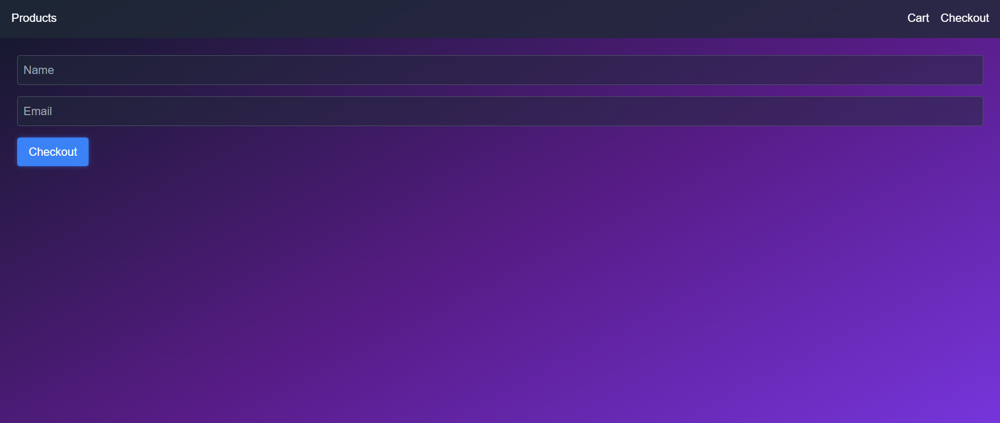

# 🛍️ Vibe Store — Full Stack E-Commerce Web App (MERN + Tailwind CSS)

Vibe Store is a modern, minimal, and responsive **full-stack e-commerce web application** built using the **MERN stack (MongoDB, Express, React, Node.js)** and **Tailwind CSS**.  

It demonstrates seamless frontend–backend communication, real-time product rendering, dynamic cart management, and a simple checkout process — all integrated through RESTful APIs.  

---

## 🚀 Project Overview

The **Vibe Store** provides a clean interface for users to:
- View available products fetched from a backend API.
- Add or remove products from their cart.
- View the total amount dynamically.
- Proceed to checkout with their details.

It’s a lightweight version of an e-commerce app focused on demonstrating **component-based architecture**, **API communication**, and **state management** in React.

---

## 🧠 How the Project Works (Step-by-Step Explanation)

### 🏗️ 1. Application Flow
1. **Frontend (React + Vite)** sends requests to the **backend API (Express + Node.js)**.
2. The **backend** retrieves product data from **MongoDB** and sends it to the frontend.
3. The **frontend renders** the data dynamically inside React components using `useEffect()` and `useState()`.
4. When a user adds a product to the cart:
   - The product is stored in the frontend’s local state (not in DB).
   - The Cart page retrieves this state to display items and total cost.
5. The **Checkout page** collects basic customer information and could later send it to the backend for order creation.

---

### ⚙️ 2. Internal Architecture (Frontend Components)

The frontend is built with **React + Vite** and styled using **Tailwind CSS**.  
Here’s how the component structure works internally:

#### 🧩 `App.jsx`
- The **root component** that defines routing for all pages using `react-router-dom`.
- Routes:
  - `/` → Product Listing Page
  - `/cart` → Cart Page
  - `/checkout` → Checkout Page

#### 🧭 `Navbar.jsx`
- A reusable top navigation bar with links to:
  - **Products**
  - **Cart**
  - **Checkout**
- Stays visible on all pages for easy navigation.

#### 🛍️ `ProductsPage.jsx`
- Fetches product data from the backend using the **Axios API instance** (`api.js`).
- Displays product cards dynamically using a `ProductCard` component.
- Each card includes:
  - Product Name
  - Price
  - “Add to Cart” button
- When clicked, it updates the global cart state.

#### 🧾 `CartPage.jsx`
- Displays items added to the cart.
- Shows:
  - Product name
  - Quantity
  - Price
  - “Remove” button
- Automatically recalculates the **total** when items are added or removed.

#### 💳 `CheckoutPage.jsx`
- Simple form with **Name** and **Email** fields.
- Prepares data for a checkout process (can later be integrated with Stripe or Razorpay).
- Acts as the final step in the user journey.

---

### 🌐 3. External Architecture (Backend + API)

The backend uses **Node.js + Express** and connects to **MongoDB** using Mongoose.

#### 🧱 Backend Structure:
- `server.js` → Entry point for the backend server.
- `routes/productRoutes.js` → Defines routes for fetching products.
- `models/Product.js` → MongoDB schema for products.
- `controllers/productController.js` → Handles logic for getting product data.

#### 🧩 API Endpoints
| Method | Endpoint | Description |
|--------|-----------|-------------|
| GET | `/api/products` | Fetch all products |
| POST | `/api/checkout` | (Future) Handle checkout process |

The backend runs at **`http://localhost:4000`**, and the frontend communicates with it via the base URL set in `.env`:


---
---

## 🖼️ App Preview (Screenshots)

Below are a few screenshots showcasing the user flow across different pages of the **Vibe Store** web app:

### 🛒 Product Page


### 🧺 Cart Page


### 💳 Checkout Page


---


## 🧭 Navigation Guide (User Experience Flow)

1. **Home Page (Products)**  
   When the app opens, users land on `/` — the Products page.  
   They can view all available items such as T-Shirts, Hoodies, Mugs, etc.

2. **Add to Cart**  
   Clicking “Add to Cart” adds the product to a local React state (cart context).  
   The Cart link in the navbar allows the user to view selected items anytime.

3. **Cart Page**  
   Accessible at `/cart`.  
   Displays a table with product details, quantity, and total price.  
   Users can remove items before checkout.

4. **Checkout Page**  
   Accessible at `/checkout`.  
   The user fills in their name and email to simulate placing an order.

---

## 🖥️ Tech Stack

**Frontend:**
- React (Vite)
- React Router DOM
- Axios
- Tailwind CSS

**Backend:**
- Node.js
- Express.js
- MongoDB (Mongoose)
- CORS and dotenv for configuration

---

## ⚙️ Installation & Setup Guide

### 1️⃣ Clone the Repository
```bash
git clone https://github.com/sagarika312/vibe-store.git
cd vibe-store
